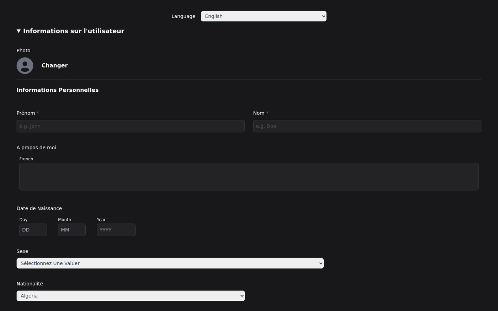

# CV Translator Desktop

Cross-platform desktop app for building Europass-style CVs with multi-language translation, structured form editing, and PDF preview.

Built with **Wails** (Go + TypeScript/Vite).

## Screenshots




## Features

- Europass-oriented CV form (personal info, experience, education, skills, …)
- Multi-language UI / content translation flows
- Profile photo support
- Desktop packaging via Wails

## Development

```bash
# Live development (Wails + Vite)
wails dev
```

## Build

```bash
wails build
```

Produces a redistributable package for your platform under `build/bin`.

## Project config

Edit `wails.json` for app settings. See [Wails project config](https://wails.io/docs/reference/project-config).
